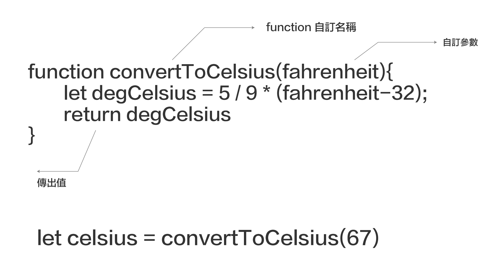

# Function(函式)

## 內建function
 
 - parseInt()
 - parseFloat()
 - Number()


## 自訂function 
### 有參數,有傳出值



```javascript

const prompt = require('prompt-sync')({sigint:true})
function convertToCelsius(fahrenheit){
	let degCelsius = 5 / 9 * (fahrenheit-32)
	return degCelsius
}

let fahrenheit = Number(prompt('請輸入華氏溫度:'))
let celsius = convertToCelsius(fahrenheit)

console.log(`華氏${fahrenheit}等於攝氏${celsius.toFixed(2)}`)

結果:==================
請輸入華氏溫度:67
華氏67等於攝氏19.44

```

### 沒有參數,沒有傳出值
```javascript

function make_a_sound(){
    console.log('火車聲')
}

make_a_sound()

結果:==================
火車聲
```


