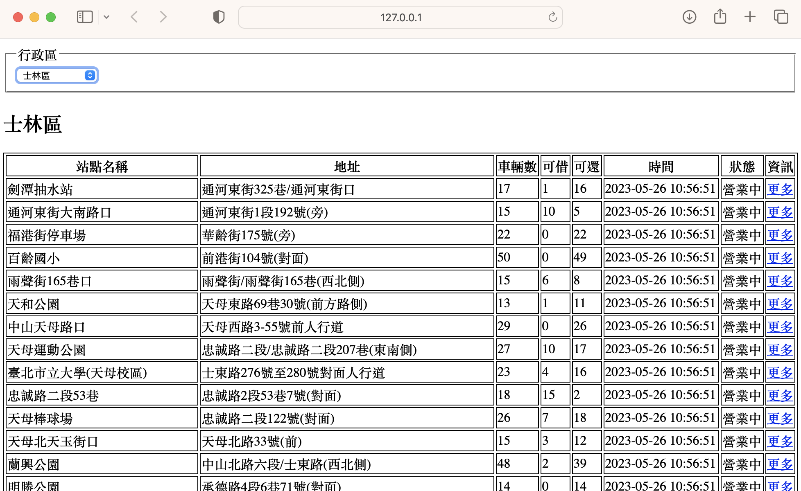
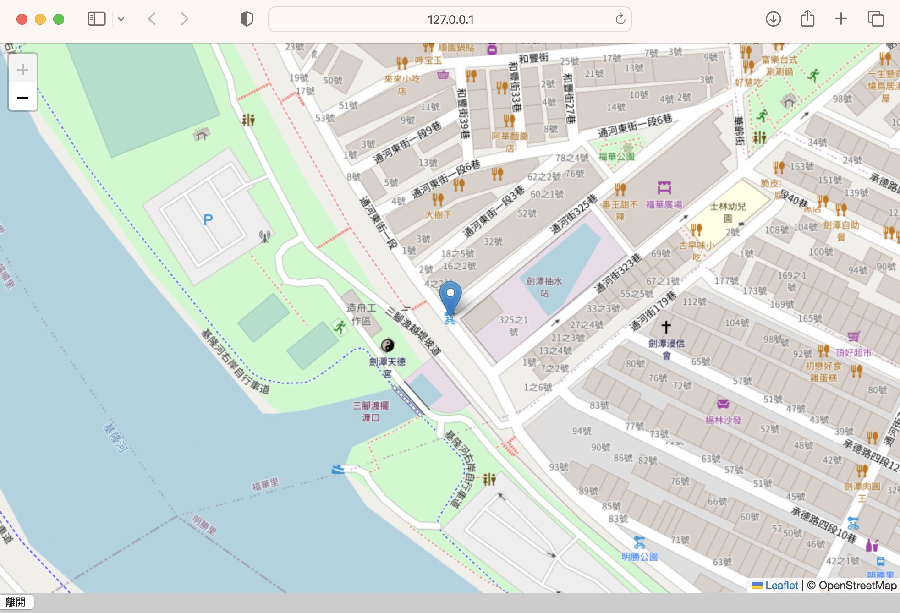
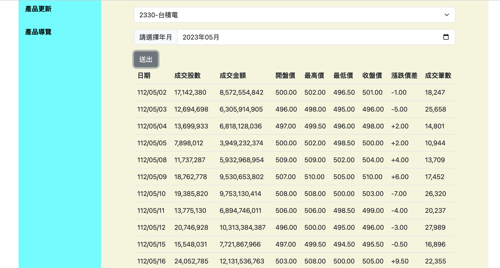
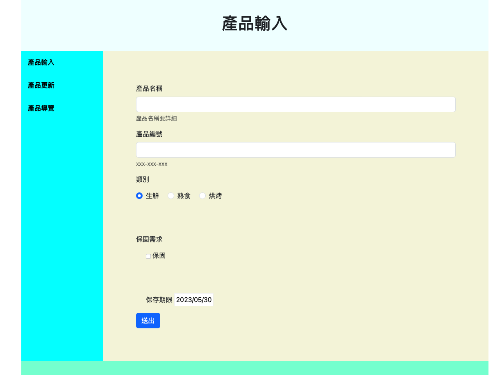
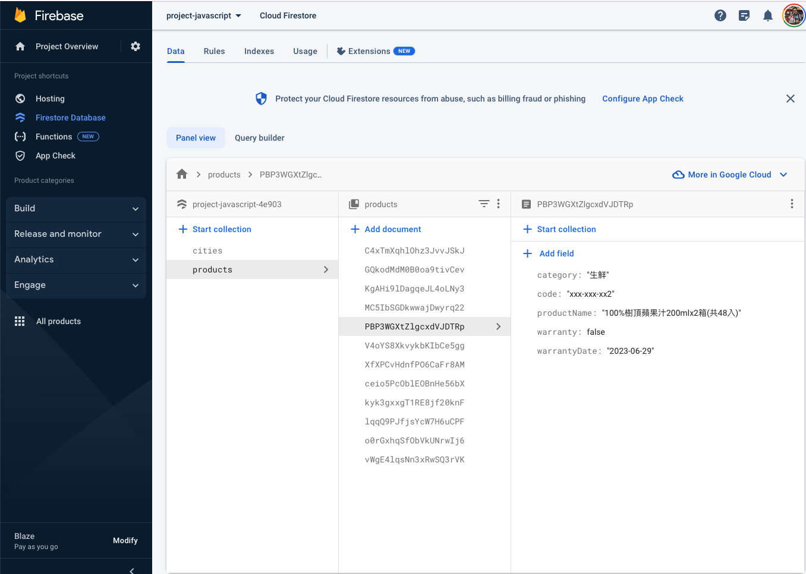
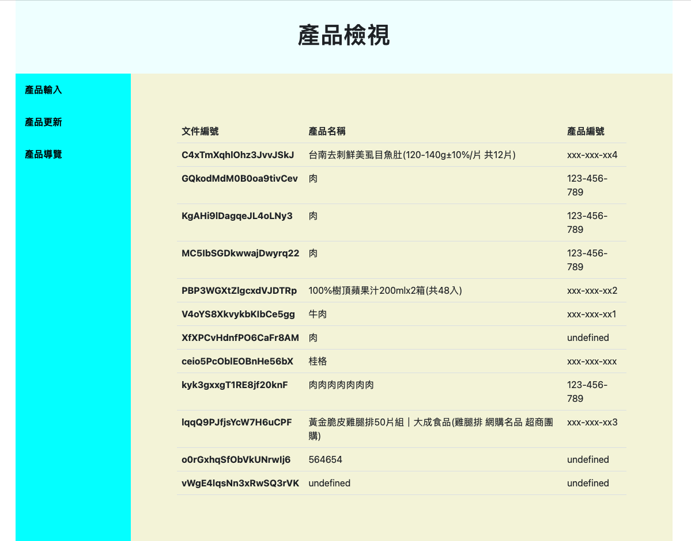

## 實際案例

### 1. [台北市youbike2.0站點](./youbike2)
- xmlhttpRequest
- openstreetmap

### 2. [台灣股市歷史記錄](./stock)
- fetch()
- 相關檔案(stock.html,stock.js,codeSearch.json)

### 3. [firebase_firestore新增,取出資料](./firebase_forestore)

- 相關檔案(index.html,view.html,index.js,view.js)

